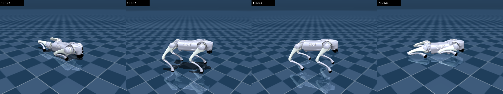
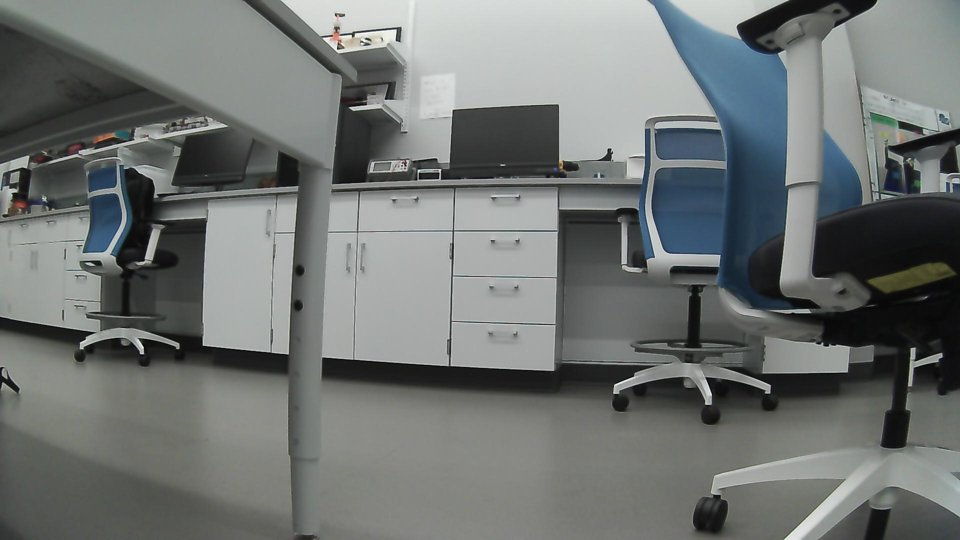
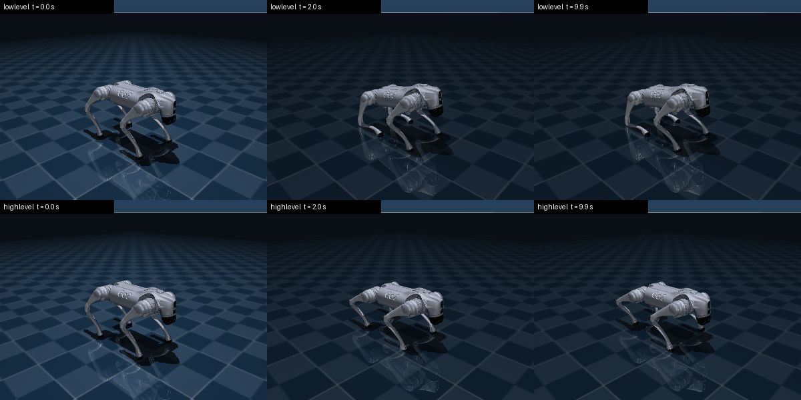
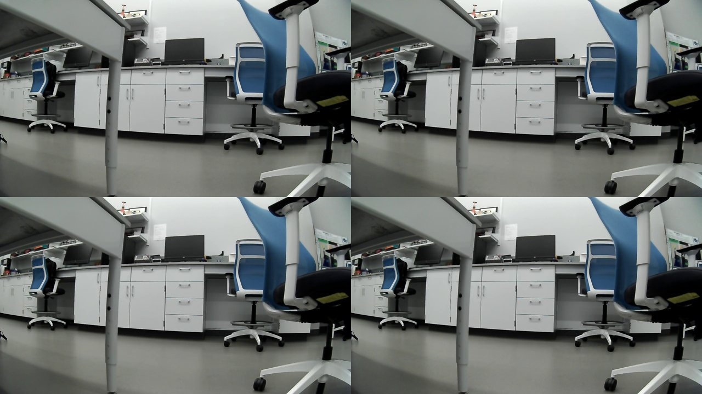
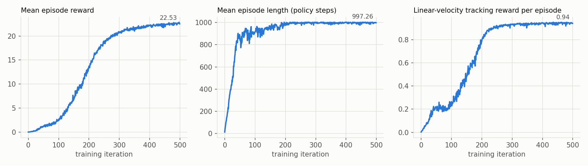
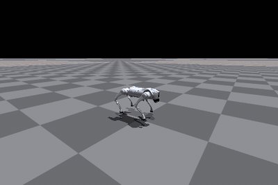

# Technical note: the Unitree Go2 X from SDK to simulation

Aidan J. Martin, ENGR 6010: AI in Robotics, Vanderbilt University, Exam 1, Q2 to Q4. October 2, 2026.

## Summary

This note covers three tasks on a Unitree Go2 X quadruped: connecting a Linux computer through Unitree's Python SDK (Q2), running demo applications from five community repositories (Q3), and planning data collection, testing perception methods on synthetic data, and training a walking policy in simulation (Q4). Every number below comes from runs logged in this repository, and each section links to its log.

Four results stand out:

1. **The Go2 X answers the SDK over Ethernet.** The Q3 survey expected DDS access (Data Distribution Service, the publish-subscribe middleware of Unitree's SDKs) only on the Go2 EDU research model. On this Go2 X, two SDK examples worked over a wired connection: one returned a 1920 x 1080 camera frame, the other read low-level state at about 26 messages per second.
2. **WebRTC works without the phone app or a per-device key.** WebRTC (Web Real-Time Communication) is the browser protocol the Unitree app uses. The robot's first signaling reply showed firmware between 1.1.11 and 1.1.14, which needs no key. A 20 s session received 1280 x 720 video at 13.7 frames per second.
3. **Go2Py's MuJoCo simulation runs fully** after two version fixes, and its walking controller holds a stable stance.
4. **Isaac Gym trains a Go2 walking policy on Ubuntu 26.04,** though NVIDIA supports only 18.04 and 20.04. 500 training iterations took 337 s. The policy tracks a 1.0 m/s command at 0.947 m/s with no falls in 100 simulated robots, and a second run reproduced all 9000 logged training values exactly.

## Terms

- **Go2 X, Go2 EDU:** the Go2 X takes velocity commands and has no onboard computer for user code. The EDU adds an NVIDIA Jetson computer and documented low-level (joint) control.
- **DDS:** Data Distribution Service, the publish-subscribe middleware of Unitree's SDKs, through the CycloneDDS implementation. Programs exchange typed messages on named topics such as `rt/lowstate`.
- **WebRTC:** Web Real-Time Communication, the protocol for video, audio and data channels between peers.
- **`LowState`:** the low-level state message: IMU (inertial measurement unit) orientation and rates, 20 motor states, battery state, foot forces and remote-control input.
- **`SportModeState`:** the high-level state message: mode, gait, body height, position and velocity.
- **PD control:** proportional-derivative control. Each joint torque is `kp (q_target - q) + kd (dq_target - dq)`, where `q` is the joint angle and `dq` its velocity.
- **PPO:** proximal policy optimization, the reinforcement learning algorithm that trains the walking policy.
- **Iteration:** one PPO update, which follows 24 policy steps in each of 4096 parallel simulated robots.

## 1. Setup

| item | value |
| :--- | :--- |
| robot | Unitree Go2 X, firmware 1.1.11 to 1.1.14 (Section 3.3) |
| computer | Intel Core Ultra 9 285K, 60 GB RAM, NVIDIA RTX 4000 Ada Generation (20 GB) |
| software | Ubuntu 26.04.1 LTS, NVIDIA driver 595.91.07, one conda environment per part, from conda-forge |
| link to the robot | USB-C Ethernet adapter, static address 192.168.123.99/24, on the robot's wired network |

Ubuntu 26.04 ships only Python 3.14, so each part runs in its own conda environment: Python 3.11 for the SDK, 3.10 for Go2Py and WebRTC, and 3.8 for Isaac Gym. Each environment has a `requirements.txt` with exact versions. The upstream repositories stay outside this repository, pinned to the commits listed in [`q2_sdk/LOG.md`](../q2_sdk/LOG.md). The computer has no Wi-Fi adapter, so every robot test ran over the Ethernet cable.

## 2. Q2: the Unitree Python SDK

Log: [`q2_sdk/LOG.md`](../q2_sdk/LOG.md).

### 2.1 Installation

`unitree_sdk2_python` needs CycloneDDS 0.10.x. CycloneDDS built from source with gcc 15.2 and cmake 4.2 without changes, and the SDK installed against it.

### 2.2 Simulated Go2

`unitree_mujoco` simulates a Go2 that speaks the SDK's messages. Its Python simulator publishes `rt/lowstate` and `rt/sportmodestate` at 200 Hz and applies `rt/lowcmd` (joint commands). It provides no sport-mode, motion-switcher or video services. Three settings of the stock simulator block the SDK examples:

- With no gamepad attached, it exits its physics thread and leaves a frozen window.
- It uses DDS domain 1, but the examples use domain 0.
- It runs until its window closes.

A short wrapper, [`sim_go2.py`](../q2_sdk/sim_go2.py), keeps the simulator's model and message bridge unchanged, runs on domain 0 over the loopback interface with no gamepad, and records a GIF and body-height trace offscreen.

| example | change | result |
| :--- | :--- | :--- |
| `helloworld` publisher and subscriber | none | all 12 messages in 12 s received |
| `go2_stand_example.py` | none | fails: the motion-switcher request gets no reply, and the example stops with a `TypeError` |
| `go2_stand_example.py` | motion-switcher calls removed | stands from lying to a peak body height of 0.336 m, holds, then crouches |
| `wireless_controller.py` | Go2 message type; simulator topic | 574 and 577 `LowState` messages in two 3 s runs, about 200 per second |
| `go2_sport_client.py` | none | not supported: the stand-up request gets no reply, because the simulator has no sport-mode service |

*Figure 1. The simulated Go2 lying, standing, holding and crouching under `go2_stand_example.py` with its service calls removed.*

Four behaviors of the simulated robot matter when reading these results:

- **Peak height repeats; timing varies by about 0.1 s.** Two runs reached the same peak, 0.336 m, but the example process starts at a slightly different time each run.
- **The body sags while holding.** It drops from 0.336 m to about 0.30 m, because the example's PD gains (`kp = 60`, `kd = 5`) include no gravity compensation.
- **The first command can arrive before any state.** The control loop raised `AttributeError` once or twice, until the first `LowState` message arrived.
- **The legs drift after the example exits.** The simulator converts each command into a fixed torque when the message arrives, and keeps applying that torque. A real robot's motor controllers keep tracking the last target instead.

### 2.3 Real Go2 X over Ethernet

The plan expected a Go2 X to refuse DDS. On the wired network, the robot's main board answered at Unitree's documented address, and nothing answered at the address of an EDU's Jetson computer. Two read-only SDK examples then ran, once each:

| example | change | result |
| :--- | :--- | :--- |
| `front_camera/capture_image.py` | none | the robot's video service returned a 1920 x 1080 JPEG of 144 KB |
| `wireless_controller.py` | Go2 message type, upstream topic `rt/lf/lowstate` | 78 `LowState` messages in a 4 s run including start-up, about 26 per second |

*Figure 2. A front camera frame from the real Go2 X, returned by `capture_image.py` over DDS (reduced to 960 x 540).*

No motion command was sent to the real robot. Whether this Go2 X also accepts sport-mode or joint commands over DDS remains untested.

## 3. Q3: Go2 demo applications

Log: [`q3_apps/LOG.md`](../q3_apps/LOG.md). Survey: [`q3_apps/REPO_SURVEY.md`](../q3_apps/REPO_SURVEY.md).

### 3.1 Choosing a repository

| repository | robot link | runs without the robot | fit for a Go2 X |
| :--- | :--- | :--- | :--- |
| go2_robot | DDS through unitree_ros2 | no | needs ROS 2 Humble and EDU topics |
| go2-webrtc | WebRTC | no | yes; firmware up to 1.1.14 |
| unitree-go2-slam-nav2 | DDS through unitree_ros2 | not stated | needs added depth camera and LiDAR |
| Go2-Dynamic-Inspection | WebRTC bridge for velocity | yes, Gazebo | needs ROS 2, CUDA and an added Livox LiDAR |
| Go2Py | DDS through a bridge on the EDU's Jetson | yes, MuJoCo | simulation only |

The survey chose two: a WebRTC client for the real robot (go2-webrtc, or its successor `unitree_webrtc_connect` for firmware 1.1.15 and later), and Go2Py for simulation. Section 2.3 showed that this Go2 X also answers DDS, which the survey's recommendation did not expect; the survey now ends with a dated correction.

### 3.2 Go2Py in MuJoCo

Go2Py's notebook `examples/02-MuJoCo-sim.ipynb` ran unchanged and unattended. The first run completed its low-level half and failed in three cells of its high-level half:

- **The walking policy would not load.** Go2Py loads it with `torch.load` and no device mapping, and the checkpoint was saved on a GPU, so a CPU-only PyTorch cannot load it. A CUDA build of PyTorch loads it unchanged. The next cell failed only because the first had.
- **The laser scan failed.** It calls MuJoCo's `mj_multiRay` without the `normal` argument that MuJoCo 3.5.0 made required. Checking each release's function signature showed that 3.4.0 is the newest version without it.

With MuJoCo 3.4.0 and PyTorch 2.11.0 for CUDA 12.8, every cell runs. The notebook renders the front camera, builds a point cloud from the depth camera, runs 10 s of joint torque control, then loads the "walk these ways" policy and runs it for 10 s at zero commanded velocity.

The notebook shows motion only in live windows, so [`go2py_record.py`](../q3_apps/go2py_record.py) repeats its two loops offscreen with a fixed number of steps. Both loops settle at a body height of 0.25 m. The low-level loop holds Go2Py's sitting pose; the policy holds a standing crouch. Two runs produced identical body-height traces.

*Figure 3. Go2Py in MuJoCo. Top: PD control toward the sitting pose. Bottom: the "walk these ways" policy at zero commanded velocity.*

### 3.3 Real Go2 X over WebRTC

Which WebRTC library applies depends on the firmware, and the firmware version normally comes from the phone app. Without the app, [`probe_signaling.py`](../q3_apps/probe_signaling.py) sends only the first signaling request and reads the `data2` field of the reply. The robot answered on port 9991 with `data2 = 2`: firmware 1.1.11 to 1.1.14, no per-device key needed.

[`webrtc_read_state.py`](../q3_apps/webrtc_read_state.py) then connected with `unitree_webrtc_connect` over the Ethernet cable. It connected in 0.5 s and recorded for 20 s, sending no motion commands:

| stream | received | contents |
| :--- | :--- | :--- |
| front camera | 274 frames, 13.7 per second | 1280 x 720 color video |
| `rt/lf/sportmodestate` | 400 messages, 20 per second | mode 0, body height 0.321 m, body speed below 0.04 m/s |
| `rt/lf/lowstate` | 20 messages, 1 per second | battery 38 % at 28.45 V; four foot forces from 78 to 94; yaw drift of 0.007 rad in 20 s while standing still |

*Figure 4. Front camera frames received over WebRTC from the real Go2 X during the 20 s session.*

### 3.4 DDS and WebRTC compared

The same topic, `rt/lf/lowstate`, arrived at about 26 messages per second over DDS and at 1 per second over WebRTC. The camera also differs: DDS returns single 1920 x 1080 frames on request, while WebRTC streams 1280 x 720 video. WebRTC needs no network setup beyond reaching the robot, and it carries video, but its low-level state rate is too slow for logging joint motion.

## 4. Q4: data and simulation

### 4.1 Data collection plan

The plan ([`q4_data_sim/data_collection_plan.md`](../q4_data_sim/data_collection_plan.md)) records camera video, `LowState`, `SportModeState`, LiDAR and pose over WebRTC on a Raspberry Pi 4 mounted on the robot. Every message gets two time stamps on arrival. The robot tests change two of its assumptions:

- **Low-level state rate.** The plan cites a 1 Hz rate for low-level state over WebRTC on firmware 1.1.7. This robot shows the same rate on firmware 1.1.11 to 1.1.14 (Section 3.3), so WebRTC alone cannot log joint motion.
- **DDS logging.** The plan ruled out the suggested DDS-based recorder, `unitree_go2_create_dataset`, because a Go2 X was not expected to expose DDS. This robot does (Section 2.3), at 26 low-level messages per second, so a wired logger on DDS becomes an option for joint data. That recorder is built on ROS 2 and remains untested here.

### 4.2 Synthetic data

Until robot data exists, five scripts test the five perception methods of the Q1 review on synthetic images with exact ground truth and a fixed seed. Full tables: [`q4_data_sim/results/SUMMARY.md`](../q4_data_sim/results/SUMMARY.md).

| method | key result |
| :--- | :--- |
| color-space segmentation | under a shadow, HSV keeps IoU 1.000; RGB falls to 0.542 and CIELAB to 0.534 |
| Gaussian pyramid | Laplacian reconstruction is exact; blurring before 2x downsampling cuts aliasing error 62 times |
| optical flow | pyramidal Lucas-Kanade recovers a (12, 9) px shift exactly; single-level Lucas-Kanade misses it by 15 px |
| GrabCut | all or nothing: every run either separates the object (IoU above 0.99) or collapses to an empty mask, switching between color overlaps 0.38 and 0.32 |
| supervised learning | under a brightness and contrast shift, accuracy drops by 0.10 to 0.25 across five classifiers |

### 4.3 Simulation with unitree_rl_gym

Log: [`q4_data_sim/simulation/LOG.md`](../q4_data_sim/simulation/LOG.md).

**Compatibility.** `unitree_rl_gym` trains in Isaac Gym Preview 4, a 2022 release that NVIDIA lists for Ubuntu 18.04 and 20.04 with Python 3.8. On Ubuntu 26.04 with the RTX 4000 Ada, driver 595.91.07, PyTorch 2.3.1 and CUDA 12.1, Isaac Gym loads and runs GPU physics. It needed two environment fixes:

- **Search paths.** Isaac Gym compiles a small C++ bridge with the `ninja` build tool on first import, so the environment's `bin` folder must be on `PATH`. The environment's `lib` folder, which holds `libpython3.8.so`, must be on `LD_LIBRARY_PATH`.
- **Pillow version.** `unitree_rl_gym` pins numpy 1.20, and Pillow 10 uses a numpy feature added in 1.21, so Pillow is held at 9.5.0.

**No MuJoCo fallback for the Go2.** `unitree_rl_gym` can replay trained policies in MuJoCo, but it ships that config and a pretrained policy only for its humanoids (G1, H1, H1_2). For the Go2, Isaac Gym is the only path.

**Training.** The `go2` task trains PPO with 4096 simulated robots on flat ground, rewarding them for tracking random velocity commands. A short run of 500 iterations (the default is 1500), seed 1:

| quantity | value |
| :--- | :--- |
| run time | 337 s; 0.68 s per iteration; about 144,000 simulation steps per second |
| simulation steps | 49.2 million |
| mean episode reward | 0.00, then 2.68 at iteration 100, 13.72 at 200, 22.53 at 499 |
| mean episode length | 13.7 policy steps at the start; 997.3 of 1000 at iteration 499 |
| velocity-tracking reward per episode | 0.002 at the start; 0.940 at iteration 499 |

*Figure 5. Training curves of the Go2 policy over 500 iterations.*

The curves show two stages. The robots first learn not to fall: episode length reaches about 900 of 1000 steps by iteration 60. They then learn to follow the command: velocity tracking rises from 0.2 to 0.9 between iterations 100 and 220, and levels off near 0.94.

**Repeatability.** A second training run with the same seed matched the first in every one of 9000 logged values (18 quantities over 500 iterations). Only timing differed. With a fixed seed, GPU physics and training reproduce exactly on this computer.

**Playback.** [`play_record.py`](../q4_data_sim/simulation/play_record.py) follows the repository's test settings, with 100 robots, no observation noise and no pushes. It commands every robot to walk straight ahead at 1.0 m/s for 10 s:

| quantity | value |
| :--- | :--- |
| measured forward speed after 2 s, mean over 100 robots | 0.947 m/s (range 0.889 to 0.991 over time) |
| robot 0 | 0.947 m/s, standard deviation 0.052 m/s |
| falls | 0 of 100 |

*Figure 6. Robot 0 walking under the trained policy at a commanded 1.0 m/s.*

## 5. Limitations

- **One robot.** All robot results come from one Go2 X on one firmware range, connected by Ethernet only. Other Go2 X units or firmware may close DDS.
- **No motion on the real robot.** Every real-robot test was read-only.
- **A short, flat-ground policy.** The policy trained for a third of the default iterations, on flat ground, and was tested only in the simulator it trained in. It never ran in a second simulator or on the robot.
- **Go2Py on pinned versions.** Go2Py runs only with MuJoCo 3.4.0 or older and a CUDA build of PyTorch.

## 6. Reproducing the results

The repository README gives the commands for each part. Three scripts regenerate the simulation results:

- [`q2_sdk/run_sim_examples.sh`](../q2_sdk/run_sim_examples.sh): every simulated SDK run.
- [`q3_apps/go2py_record.py`](../q3_apps/go2py_record.py): the Go2Py recordings.
- [`q4_data_sim/simulation/run_go2.sh`](../q4_data_sim/simulation/run_go2.sh): training, curves and playback, in about 7 minutes.

The robot tests need the robot on the wired network and its address in an untracked `.env` file.

## References

1. Unitree Robotics, unitree_sdk2_python. https://github.com/unitreerobotics/unitree_sdk2_python
2. Unitree Robotics, unitree_mujoco. https://github.com/unitreerobotics/unitree_mujoco
3. Unitree Robotics, unitree_rl_gym. https://github.com/unitreerobotics/unitree_rl_gym
4. Eclipse Foundation, Cyclone DDS, branch releases/0.10.x. https://github.com/eclipse-cyclonedds/cyclonedds
5. R. Khorrambakht and B. Dai, Go2Py. https://github.com/machines-in-motion/Go2Py
6. legion1581, unitree_webrtc_connect. https://github.com/legion1581/unitree_webrtc_connect
7. T. Foldi, go2-webrtc. https://github.com/tfoldi/go2-webrtc
8. NVIDIA, Isaac Gym Preview 4. https://developer.nvidia.com/isaac-gym
9. ETH Zurich Robotic Systems Lab, rsl_rl v1.0.2. https://github.com/leggedrobotics/rsl_rl
10. G. B. Margolis and P. Agrawal, "Walk these ways: Tuning robot control for generalization with multiplicity of behavior," in *Proc. Conference on Robot Learning (CoRL)*, 2022.
11. abizovnuralem, go2_ros2_sdk. https://github.com/abizovnuralem/go2_ros2_sdk
